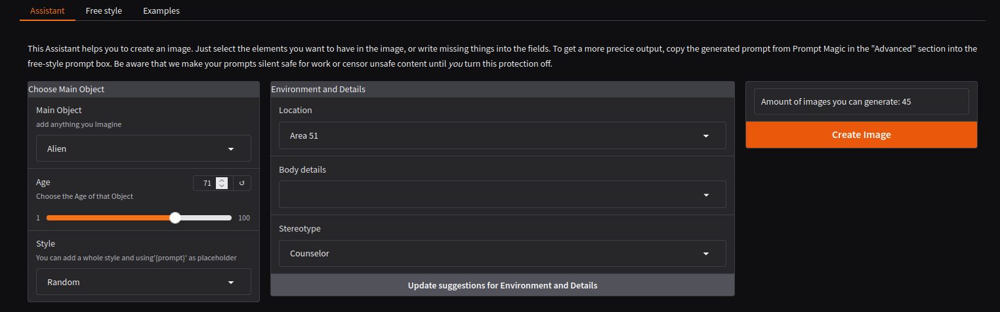

# 🎨 AI Image Generation with FLUX and Stabel Diffusion

Welcome to an exciting world of AI-powered image generation! This project leverages the powerful FLUX model from black-forest-labs to create stunning, high-quality images from text descriptions. 
Also Stable Diffusion 1.5 and XL Models are supported. 
Whether you're an artist, developer, or just curious about AI art, this tool provides an intuitive interface for your creative endeavors!

## ✨ Features

- 🖼️ Generate high-quality images from text descriptions and via Assistant
- 🪄 Smart prompt refinement via LLM
- 🎮 User-friendly Gradio interface
- 🎯 Configurable aspect ratio support (Square, Landscape, Portrait)
- 🎚️ Configurable generation parameters for Admins
- 📊 Credit-based usage system (optional)
- 💾 Automatic model management and caching
- 🛠️ Memory optimization options for different hardware setups
- 🔄 Auto-update system with version tracking

----
Generated Image Example:


Our Assistant:



----

## 🚀 Installation

Getting started is super easy! Just follow these steps:

1. Clone the repository:
```bash
git clone https://github.com/blndev/AI-ImageGeneration.git
cd AI-ImageGeneration
```

2. Create your configuration:
```bash
cp .env.example .env
```

3. Edit `.env` file and set your HuggingFace Access token:
```bash
HUGGINGFACE_TOKEN=your_token_here
```

> 📝 **Note**: You'll need to accept the license agreement for FLUX.1-schnell at [HuggingFace](https://huggingface.co/black-forest-labs/FLUX.1-schnell)

## 🎮 Running the Application

The project includes a convenient `run.sh` script that handles:
- ✅ Environment setup
- ✅ Dependency management
- ✅ Version checking
- ✅ Application startup

Simply execute:
```bash
chmod +x run.sh
./run.sh
```

## ⚙️ Configuration

Customize your experience through environment variables in `.env`:

### 🎛️ General Settings
- `LOG_LEVEL`: Set logging detail (DEBUG, INFO, WARNING, ERROR, CRITICAL)
- `GRADIO_SHARED`: Enable public Gradio link
- `NO_AI`: Development mode without AI processing
- `FREE_MEMORY_AFTER_MINUTES_INACTIVITY`: release the used model from GPU memory after minutes of inactivity

### 🎫 Credit System
- `INITIAL_GENERATION_TOKEN`: Starting Credits for new users (0=unlimited)
- `NEW_TOKEN_WAIT_TIME`: Minutes to wait for Credit refreshes
- `FEATURE_SHARING_LINK_NEW_TOKEN`: allows users to share the application link to receive new Credits
- `FEATURE_UPLOAD_IMAGE_NEW_TOKEN`: allows users to share upload images to train the system, to receive new Credits

### 🪄 Prompt Magic
- `PROMPTMAGIC`: Turn on or off feature which optimize the given prompts
- `OLLAMA_SERVER`: Custom Ollama server location (default: localhost)
- `OLLAMA_MODEL`: Model for prompt enhancement (default: llava)

### 🖼️ Generation Settings
- `GENERATION_MODEL`: Choose a model specified in modelconfig.json (default: black-forest-labs/FLUX.1-dev)
- `MODELCONFIG`: optional, the path and filename of the modelconfig.json to be used (default: ./modelconfig.json)
- `FEATURE_ALLOW_NSFW`: Default: False, if turned on all our content filtering and censorship will be deactived. Be aware that could be inappropiate for some users depending on the used model

### 🎯 Output Configuration
- `MODEL_DIRECTORY`: Location for downloaded models and cache files form HF
- `OUTPUT_DIRECTORY`: Where to save generation information e.g. hashes of generated images or user feedback (empty = disabled)

### 📝 Model Configuration (modelconfig.json)

The `modelconfig.json` file supports a powerful inheritance system that allows you to define model configurations hierarchically. This helps reduce redundancy and makes it easier to manage multiple model configurations that share common settings.

#### Inheritance Example
```json
 {
    "Model": "default",
    "Description": "default configuration flux-schnell",
    "Parent": "flux1:schnell",
    "Aspect_Ratio": {
      "Square": "1024x1024"
    }
  },
  {
    "Model": "flux1:schnell",
    "Path": "black-forest-labs/FLUX.1-schnell",
    "Description": "Model Flux1-Schnell",
    "Parent": "flux",
    "Generation": {
      "steps": 5,
      "guidance": 0
    },
    "Examples": []
  },
  {
    "Model": "flux1:dev",
    "Path": "black-forest-labs/FLUX.1-dev",
    "Description": "Model Flux1-Dev",
    "Parent": "flux",
    "Generation": {
      "steps": 50,
      "guidance": 7.5
    },
    "Examples": []
  },
  {
    "Model": "flux",
    "Parent": "",
    "ModelType": "flux",
    "Generation": {
      "MAX_IMAGES": 2,
      "GPU_ALLOW_XFORMERS": 0,
      "GPU_ALLOW_ATTENTION_SLICING": 1,
      "GPU_ALLOW_MEMORY_OFFLOAD": 1
    },
    "Aspect_Ratio": {
      "Square": "1024x1024",
      "Landscape": "1152x768",
      "Portrait": "768x1152"
    },
    "Examples": []
  }
```

In this example:
1. The "default" configuration inherits from "flux1:schnell"
2. "flux1:schnell" inherits from "flux"
3. "flux" is a base configuration with no parent
4. "flux1:dev" is using same aspect rations and memory optimization but e.g. different guidance scale

This creates an inheritance chain where:
- Base settings are defined in the "flux" configuration
- "flux1:schnell" extends these settings with specific parameters for the FLUX.1-schnell model
- The "default" configuration can override or extend these settings further

Properties are inherited recursively, meaning a child configuration will receive all properties from its parent, grandparent, and so on. Child configurations can:
- Override inherited properties by redefining them
- Add new properties not present in the parent
- Inherit complex nested objects (like Aspect_Ratio, Generation settings, etc.)

This system makes it easy to:
- Maintain consistent base settings across multiple configurations
- Create specialized configurations with minimal duplication
- Quickly switch between different model setups while preserving common settings

#### Complete Configuration Example
```json
{
    "Model": "model-name",                   // Name used to reference this config
    "Path": "huggingface-repo/model-name",   // HuggingFace path or local file
    "Description": "Model description",      // Optional description
    "Parent": "parent-model",                // Optional parent config to inherit from
    "Generation": {
        "steps": 40,                         // Number of generation steps
        "guidance": 4.0,                     // Guidance scale for generation
        "GPU_ALLOW_XFORMERS": 1,             // Enable memory-efficient attention
        "GPU_ALLOW_ATTENTION_SLICING": 0,    // Split calculations for lower memory usage
        "GPU_ALLOW_MEMORY_OFFLOAD": 0        // Use CPU memory for model handling
    },
    "Aspect_Ratio": {
        "Square": "1024x1024",               // Square image dimensions
        "Landscape": "1152x768",             // Landscape image dimensions
        "Portrait": "768x1152"               // Portrait image dimensions
    },
    "Embeddings": {
        "positive": [
            {
                "name": "embedding-name",    // Name of the embedding
                "source": "embedding.pt",    // Path to embedding file
                "keyword": "trigger-word"    // Word that triggers this embedding
            }
        ],
        "negative": []                       // Negative embeddings list
    },
    "Loras": [
        {
            "name": "lora-name",             // Name of the LoRA
            "src": "lora.safetensors",       // Path to LoRA file
            "trigger": "trigger-word",       // Word that activates this LoRA
            "weight": 1.0,                   // LoRA weight (0.0 to 1.0)
            "inject_when": [                 // Keywords that trigger LoRA injection
                "keyword1",
                "keyword2"
            ]
        }
    ],
    "Examples": [                            // Optional example prompts
        [
            "A majestic mountain landscape at sunset",  // Positive prompt
            "ugly, blurry"                              // Negative prompt
        ],
        [
            "Professional portrait in modern office",
            "bad anatomy, deformed"
        ]
    ]
}
```

This configuration shows all available settings that can be defined for a model. Settings can be:
- Inherited from a parent configuration
- Partially overridden in child configurations
- Extended with additional settings
- Left undefined to use defaults

## 📊 Monitoring Setup

This application provides built-in monitoring capabilities using Prometheus metrics, exposed on port 9101. The following metrics are available:

- `imggen_image_creations`: Counter for total number of images created
- `imggen_sessions`: Counter for total number of user sessions
- `imggen_prompt_usage`: Counter for FreeStyle, Assistant and MagicPrompt usage
- `imggen_user_Credits`: Gauge showing available Credits per user
- `imggen_errors`: amount of errors and the source module

Check the Prometheus endpoint to see if there is more.


### Prerequisites
- Podman or Docker installed on your system
- Sufficient disk space for monitoring data
- Port 3000 (Grafana) and 9090 (Prometheus) available

### Quick Start
Use the provided script to automatically set up and manage monitoring containers:
```bash
./run_monitoring_podman.sh
```
This script will:
- Create necessary directories and configurations
- Start existing containers if they're stopped
- Create new containers if they don't exist
- Display the status of monitoring services

### Manual Setup
If you prefer to set up the monitoring stack manually, follow these steps:

#### Directory Structure
Create the following directory structure for persistent storage:
```bash
mkdir -p monitoring/grafana-data
mkdir -p monitoring/prometheus-data
```

#### Prometheus Setup
Create a `monitoring/prometheus.yml` configuration file:
```yaml
global:
  scrape_interval: 15s
  evaluation_interval: 15s

scrape_configs:
  - job_name: 'flux-app'
    static_configs:
      - targets: ['host.containers.internal:8080']  # Adjust port if needed
```

Start Prometheus container:
```bash
# Using Podman
podman run -d \
  --name prometheus \
  --network=host \
  -v ./monitoring/prometheus.yml:/etc/prometheus/prometheus.yml:Z \
  -v ./monitoring/prometheus-data:/prometheus:Z \
  docker.io/prom/prometheus:latest

# Using Docker
docker run -d \
  --name prometheus \
  --network=host \
  -v $(pwd)/monitoring/prometheus.yml:/etc/prometheus/prometheus.yml \
  -v $(pwd)/monitoring/prometheus-data:/prometheus \
  prom/prometheus:latest
```

### Grafana Setup
Start Grafana container:
```bash
# Using Podman
podman run -d \
  --name grafana \
  --network=host \
  -v ./monitoring/grafana-data:/var/lib/grafana:Z \
  -e "GF_AUTH_ANONYMOUS_ENABLED=true" \
  -e "GF_AUTH_ANONYMOUS_ORG_ROLE=Admin" \
  -e "GF_AUTH_DISABLE_LOGIN_FORM=true" \
  docker.io/grafana/grafana:latest

# Using Docker
docker run -d \
  --name grafana \
  --network=host \
  -v $(pwd)/monitoring/grafana-data:/var/lib/grafana \
  -e "GF_AUTH_ANONYMOUS_ENABLED=true" \
  -e "GF_AUTH_ANONYMOUS_ORG_ROLE=Admin" \
  -e "GF_AUTH_DISABLE_LOGIN_FORM=true" \
  grafana/grafana:latest
```

### Accessing the Dashboards
- Grafana: http://localhost:3000 (or your server IP for network access)
- Prometheus: http://localhost:9090

### Initial Grafana Setup
1. Log into Grafana
2. Add Prometheus as a data source:
   - URL: http://localhost:9090
   - Access: Browser
3. Import or create dashboards to visualize your metrics

### Security Note
The above configuration enables anonymous access to Grafana for simplicity. For production environments, configure proper authentication and HTTPS.

### Additional Monitoring Recommendations

For comprehensive system and GPU monitoring, we recommend installing these additional exporters:

#### Node Exporter
The Node Exporter provides detailed system metrics including CPU, memory, disk, and network statistics.

Installation:
```bash
# Download and install Node Exporter
wget https://github.com/prometheus/node_exporter/releases/download/v1.6.1/node_exporter-1.6.1.linux-amd64.tar.gz
tar xvfz node_exporter-1.6.1.linux-amd64.tar.gz
cd node_exporter-1.6.1.linux-amd64
sudo cp node_exporter /usr/local/bin/

# Create systemd service (optional)
sudo useradd -rs /bin/false node_exporter
sudo tee /etc/systemd/system/node_exporter.service << EOF
[Unit]
Description=Node Exporter
After=network.target

[Service]
User=node_exporter
Group=node_exporter
Type=simple
ExecStart=/usr/local/bin/node_exporter

[Install]
WantedBy=multi-user.target
EOF

sudo systemctl daemon-reload
sudo systemctl start node_exporter
sudo systemctl enable node_exporter
```
Node Exporter metrics will be available on :9100/metrics

#### NVIDIA GPU Exporter
For monitoring GPU metrics (utilization, memory, temperature, etc.), install the NVIDIA GPU Exporter:

```bash
# Install NVIDIA Container Toolkit
distribution=$(. /etc/os-release;echo $ID$VERSION_ID)
curl -s -L https://nvidia.github.io/libnvidia-container/gpgkey | sudo apt-key add -
curl -s -L https://nvidia.github.io/libnvidia-container/$distribution/libnvidia-container.list | \
    sudo tee /etc/apt/sources.list.d/nvidia-container-toolkit.list

sudo apt-get update
sudo apt-get install -y nvidia-container-toolkit

# Run NVIDIA GPU Exporter using Docker
docker run -d \
    --restart=always \
    --name nvidia_gpu_exporter \
    --device=/dev/nvidiactl \
    --device=/dev/nvidia0 \
    --volume=/usr/lib/x86_64-linux-gnu/libnvidia-ml.so.1:/usr/lib/x86_64-linux-gnu/libnvidia-ml.so.1 \
    nvidia/dcgm-exporter:latest
```

NVIDIA GPU metrics will be available on :9400/metrics

#### Prometheus Configuration

Add these jobs to your Prometheus configuration to collect metrics from all exporters:

```yaml
scrape_configs:
  - job_name: 'imggen_app'
    static_configs:
      - targets: ['localhost:9101']

  - job_name: 'node'
    static_configs:
      - targets: ['localhost:9100']

  - job_name: 'nvidia_gpu'
    static_configs:
      - targets: ['localhost:9400']
```
This setup will provide comprehensive monitoring of your application, system resources, and GPU utilization.

## 🤝 Contributing

We love contributions! Feel free to:
- Submit bug reports
- Propose new features
- Create pull requests

## 📜 License

This project is licensed under the terms included in the LICENSE file.

---

Happy Creating! 🎨✨
